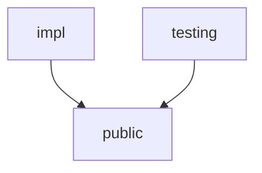

# Devkit+

An IntelliJ plugin for helping improve the workflow of developing Kotlin Multiplatform apps. 

https://plugins.jetbrains.com/plugin/28540-plus-mobile-apps-devkit/versions?noRedirect=true

## Creating Feature Modules

The generic structure of the plugin helps create feature modules with the following structure. 

* public - contains the public API for the feature module.
* impl - contains the implementation code for the feature module.
* testing - contains test code for the feature module.

To create new feature modules, right click on a file directory in the project folder and click on new feature module.

Select which feature modules you want to include in this feature module.

Place template files for each `build.gradle.kts` in `devkit` folder of your project.

* `devkit/public.gradle.kts`
* `devkit/impl.gradle.kts`
* `devkit/testing.gradle.kts`

Variables that can be replaced in your build.gradle.kts template files.

| Variable | Description |
| -------- | ----------- |
| `$directoryName` | The name of the directory you right clicked on to create the feature module. |
| `$projectDirectory` | The name of the root project directory. |
| `$namespace` | The namespace of the root project directory. |

