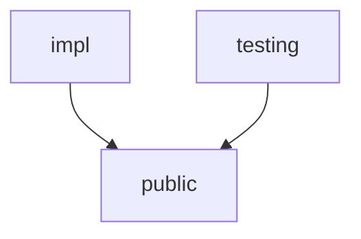

# Devkit+

An IntelliJ plugin for helping improve the workflow of developing Kotlin Multiplatform apps. 

## Creating Feature Modules

```mermaid
graph TD
    public[public]
    impl[impl]
    testing[testing]
    
    impl --> public
    testing --> public
```

