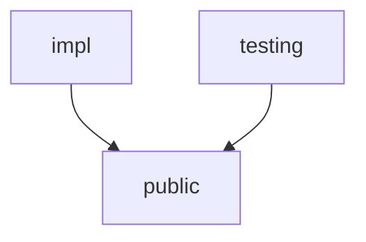

# Devkit+

An IntelliJ plugin for helping improve the workflow of developing Kotlin Multiplatform apps. 

https://plugins.jetbrains.com/plugin/28540-plus-mobile-apps-devkit/versions?noRedirect=true

## Creating Feature Modules

